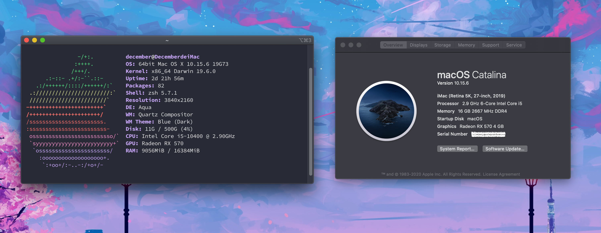
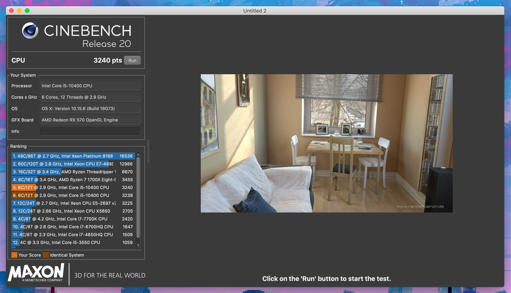
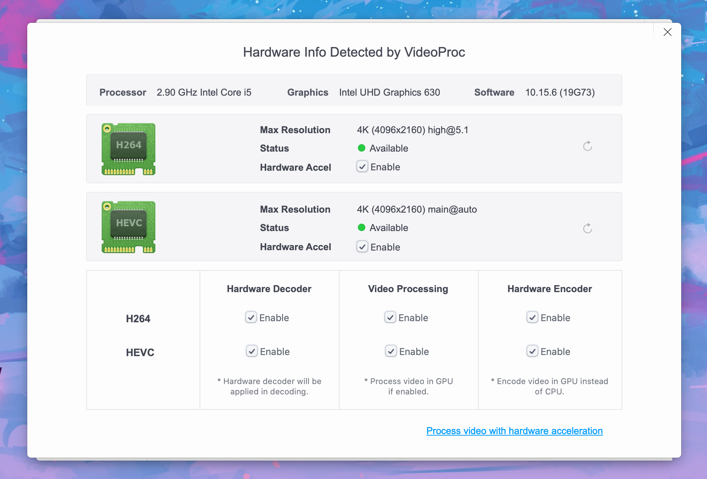
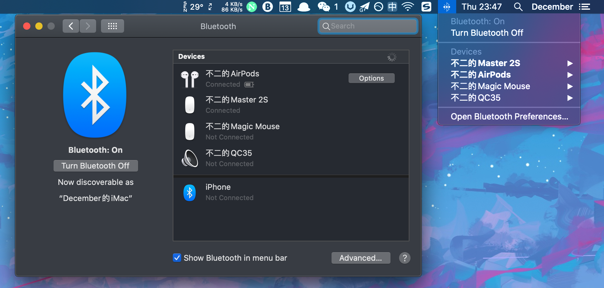

# Hackintosh-10400-B460M-MORTAR-RX570
## EFI 
OpenCore: 0.5.9

macOS version: 10.5.6

##  更新情况
2020.8.10
+ 电压 -0.105V FPU单烤 70℃ -> 56℃
+ CINEBENCH R20 +120

## 硬件配置
|组件|型号|
|------|------|
|主板|微星 B460M MORTAR|
|CPU|Intel i5 10400|
|内存|科赋CJR 8GB * 2 2666MHz|
|显卡|蓝宝石 RX570 |
|SSD|铠侠 RC10 512GB|
|SSD|雷克沙 NM610 250GB For Win10|
|电源|鑫谷 GP600G黑金版 500W|
|机箱|爱国者 M2|
|散热|雅浚 G3 + 爱国者 极光 * 5|
|网卡|博通 BCM94360CD|

## 功能测试
- [x] 睡眠/唤醒
- [x] Airdrop/Handoff/iMessage/FaceTime
- [x] 所有USB端口
- [x] 核显硬件加速
- [x] 蓝牙/WiFi
- [x] 声卡输出
- [x] Sidecar

### CPU，内存，显卡识别正常

### CINEBENCH R20 和 Geekbench 5 跑分

### H264 和 HEVC 硬解

### Airdrop

### 蓝牙

### Sidecar
